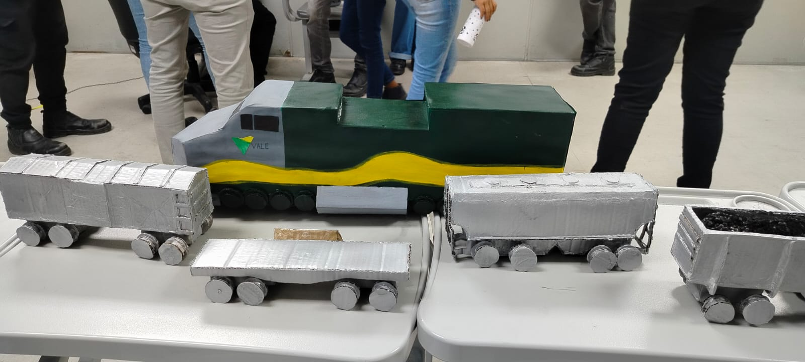
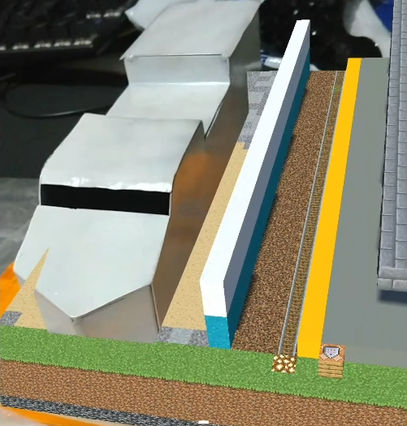
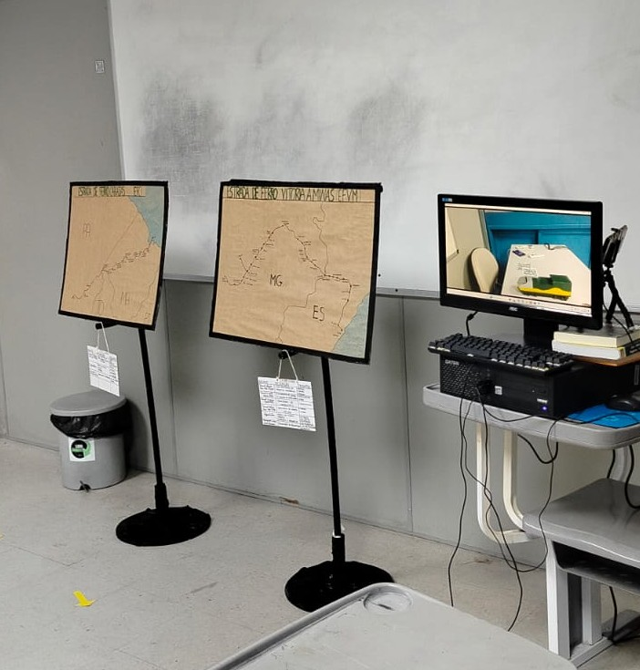
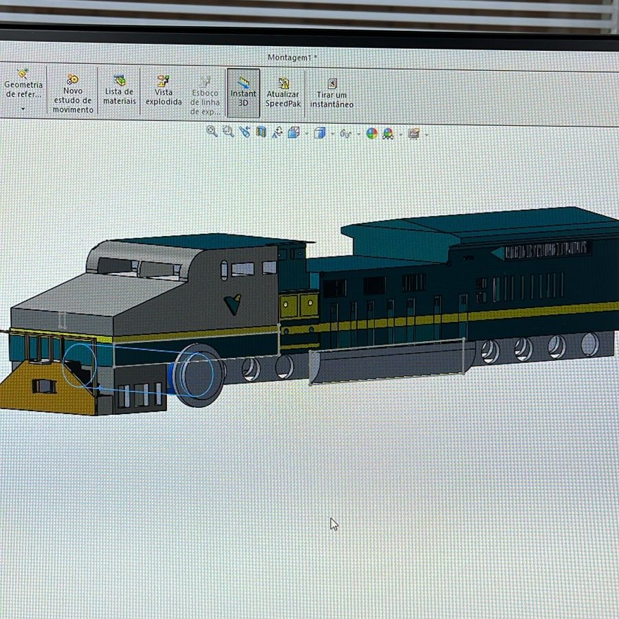
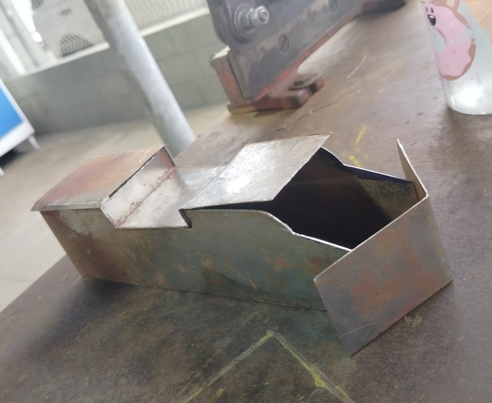

# Malha Ferroviária — Projeto Integrador

	

Esse projeto consiste em duas apresentações da Estrada de Ferro Vitória a Minas da Vale, uma em realidade aumentada e outra em realidade virtual, sendo entregues como Projeto Integrador para a conclusão do curso de aprendizagem técnica industrial do Senai em 2024.

## Descrição

A proposta desse projeto foi apresentar as principais estações da EFVM de forma lúdica, utilizando a realidade virtual (VR) e realidade aumentada (AR) como ferramentas para tal. 
Foram contempladas as estações de Pedro Nolasco, Aimorés, Governador Valadares, Itabira e Belo Horizonte. 

	

## Realidade Virtual 

A realidade virtual foi utilizada para simular uma experiência de viagem partindo de Vitória até Belo Horizonte, acompanhando o ponto de vista de um passageiro. Usando um dispositivo Android e um óculos mobile estilo cardboard, o usuário pode escolher entre as cinco apresentações, que podem ser vistas em um [desktop por meio dessa playlist](https://www.youtube.com/playlist?list=PL3JiqLSDHim13iy7YkcJWuTGjGZXwYc5F). Esse aplicativo pode ser [baixado por aqui](https://github.com/KingOfCactus/Apresentacao-Malha-Ferroviaria/releases/download/v1.0.0/VR.-malha-ferroviaria.apk).

	

## Realidade Aumentada 

Contém informações gerais sobre a malha ferroviária nacional e uma breve descrição de cada uma das estações. As estações são projetadas em volta de um protótipo de locomotiva de passageiros confeccionado com chapas de metal, simulando o trajeto real da mesma. Esse aplicativo pode ser [baixado por aqui](https://github.com/KingOfCactus/Apresentacao-Malha-Ferroviaria/releases/download/v1.0.0/AR.-malha-ferroviaria.apk), sendo necessário escanear esse [qrcode](https://github.com/KingOfCactus/Apresentacao-Malha-Ferroviaria/blob/main/GitHub/qrcode.png) durante o uso do mesmo.

	
	

## Como foi feito

As estações foram construidas no Minecraft e exportadas para a Unity utilizando o [MiEx](https://github.com/BramStoutProductions/MiEx) e o Blender. Na Unity foram utilizadas a ARFoundation, o CardboardSDK e um [shader de terceiros](https://github.com/doomlaser/DepthMask-Unity-Shader) para a máscara de profundidade/oclusão. O protótipo da locomotiva foi feito usando as ferramentas disponíveis no Senai, como dobradeira, gilhotina, disco de desbaste, etc. A fabricação foi feita com base no desenho técnico elaborado no Solidworks, fazendo adaptações quando necessário.

	
	

Para construir as estações, foram feitas medições aéreas no Google Earth e agrupadas imagens no Miro para fins de planejamento e organização. Dentro do Minecraft foram usadas algumas ferramentas para ajudar na construção, principalmente o WorldEdit. Para hospedagem do server da construção, foi usado o Always Free Tier da Oracle Cloud, em uma instância 'VM.Standard.A1.Flex' rodando Ubuntu, sendo disponível 24/7.

	

|      **GRUPO**       |             **CONTRIBUIÇÃO PRINCIPAL**             |
| :------------------- | -------------------------------------------------: |
| **Victor Hugo**      | Minecraft (líder), Programação e Organização Geral |                 
| **Mariana Trindade** | Caldeiraria (líder), Minecraft e Organização Geral |
| **Thielly Cristini** | Pesquisa, Caldeiraria, Minecraft e Decoração       |
| **Bianca Berger**    | Pesquisa, Caldeiraria, Minecraft e Decoração       | 
| **Állan Holz**       | Solidworks, Caldeiraria e Minecraft		    |
| **Juan Carlos**      | Solidworks e Minecraft 	                    |
| **Gabriel Lopes**    | Pesquisa e Minecraft                               |

|      **AGRADECIMENTOS ESPECIAIS**       |  **CONTRIBUIÇÃO PRINCIPAL**  |
| :-------------------------------------- | ---------------------------: |
| **Murilo Quartezani**                   | Auxílio no Minecraft         |                 
| **Nicolas Goldner**                     | Auxílio no Minecraft         |

